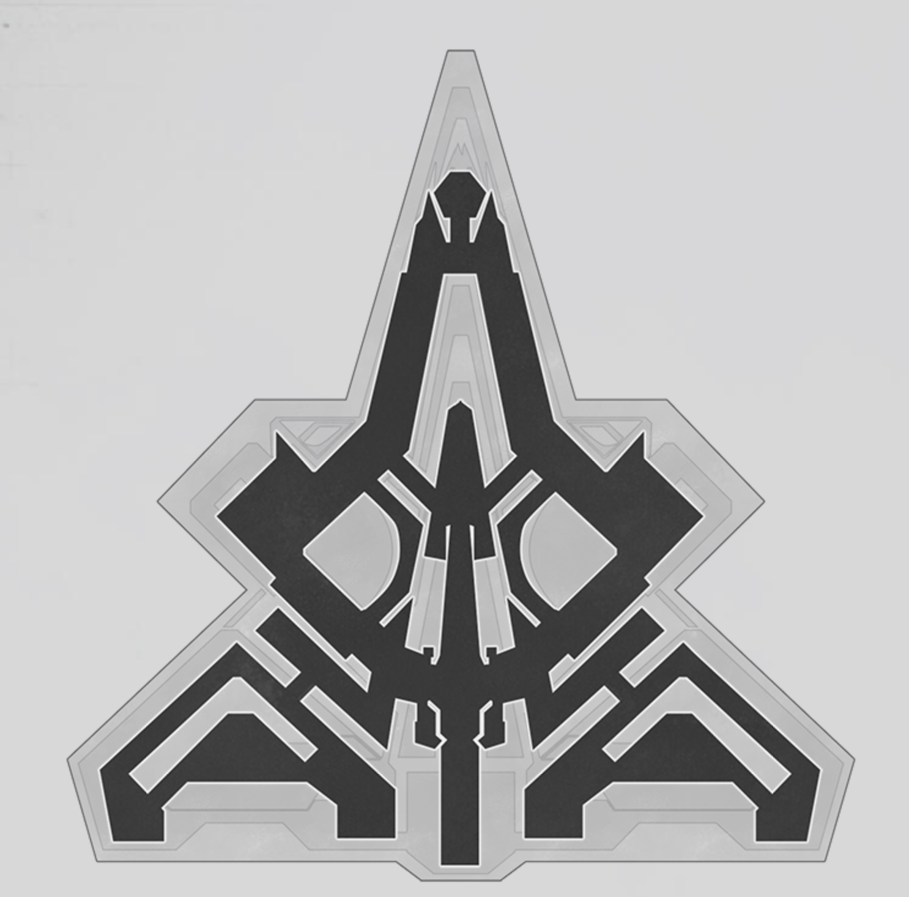
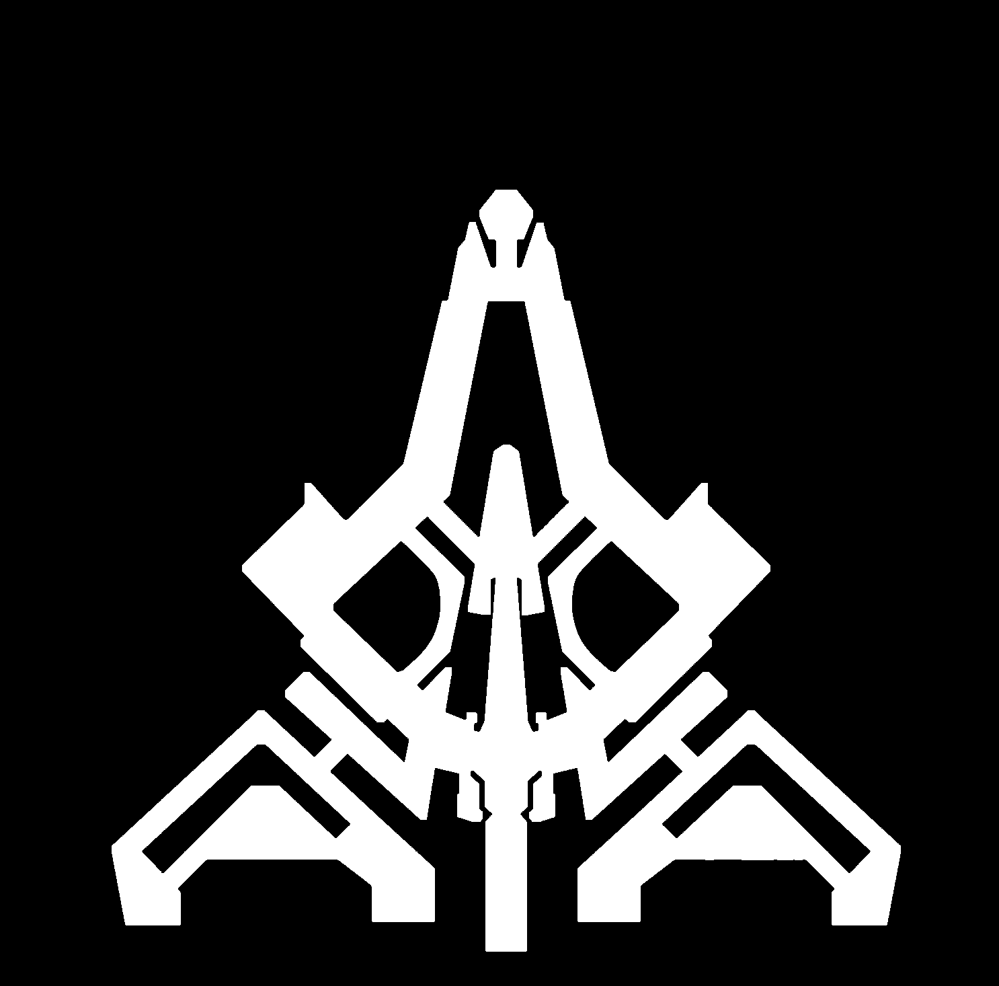
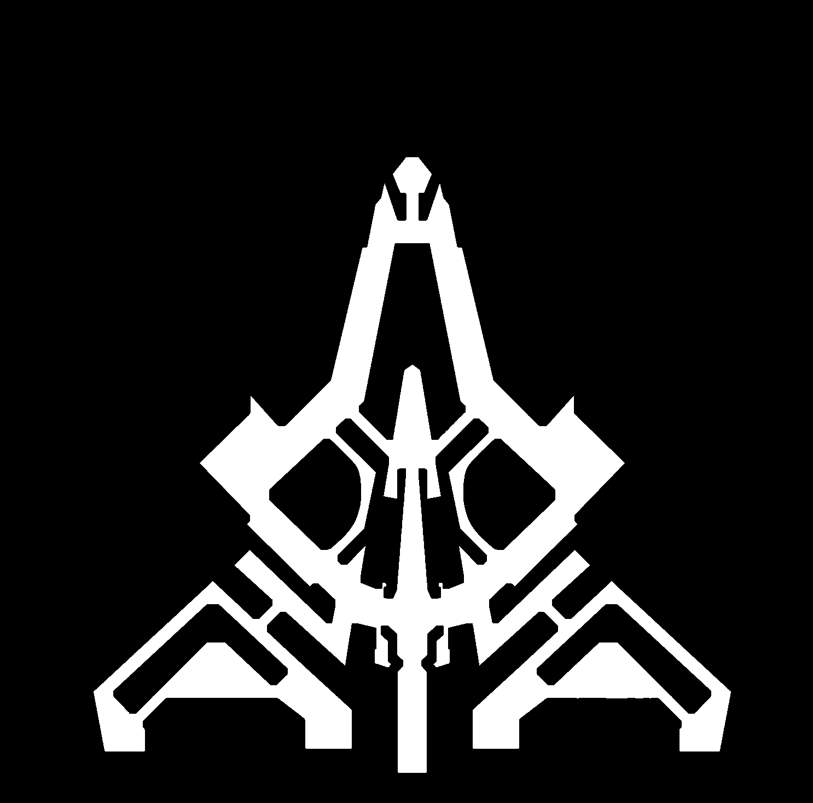
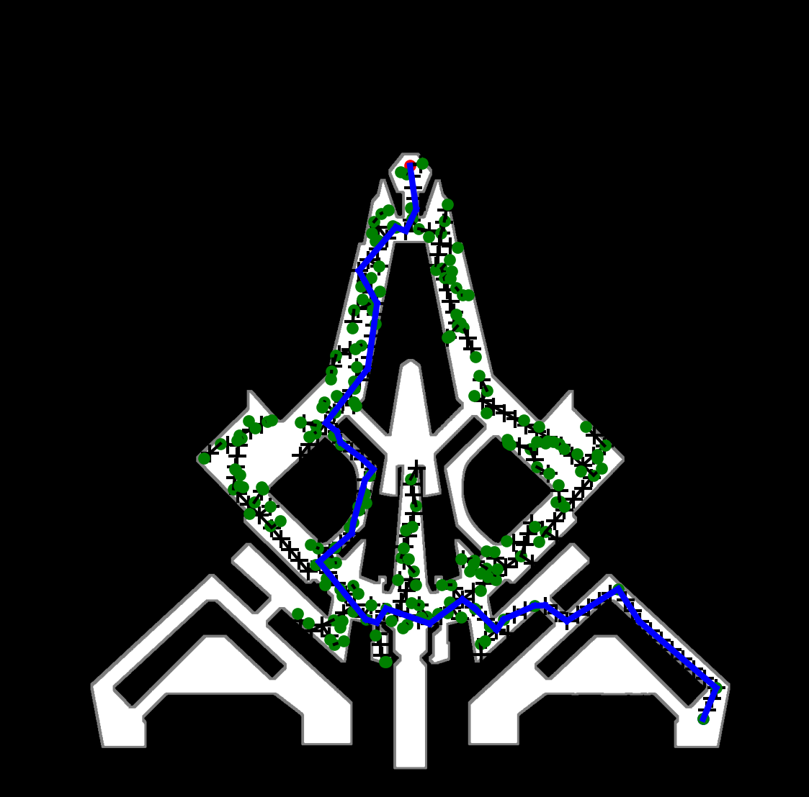

# StarRail_navigation

This is a navigation proposal and demonstration for StarRail. The main idea is to extract a clear map and convert it to black and white images.

Different from Genshin Impact, StarRail has a clearer, simpler, and more concise concept map image, which makes it easy to distinguish pathways and obstacles.

The white part is the free space to walk and run, while the black part consists of walls and obstacles.

The path search algorithm proposed and demonstrated is Rapidly Exploring Random Tree (RRT). The path node will be randomly generated like tree branches from the start point to the target point. The path with the shortest travel distance will be connected as the planned path.

# Example:
| Original Map | Filtered Map | Eroded Map | Planned Path |
|--------------|--------------|------------|--------------|
| { width=200px } | { width=200px } | { width=200px } | { width=200px } |