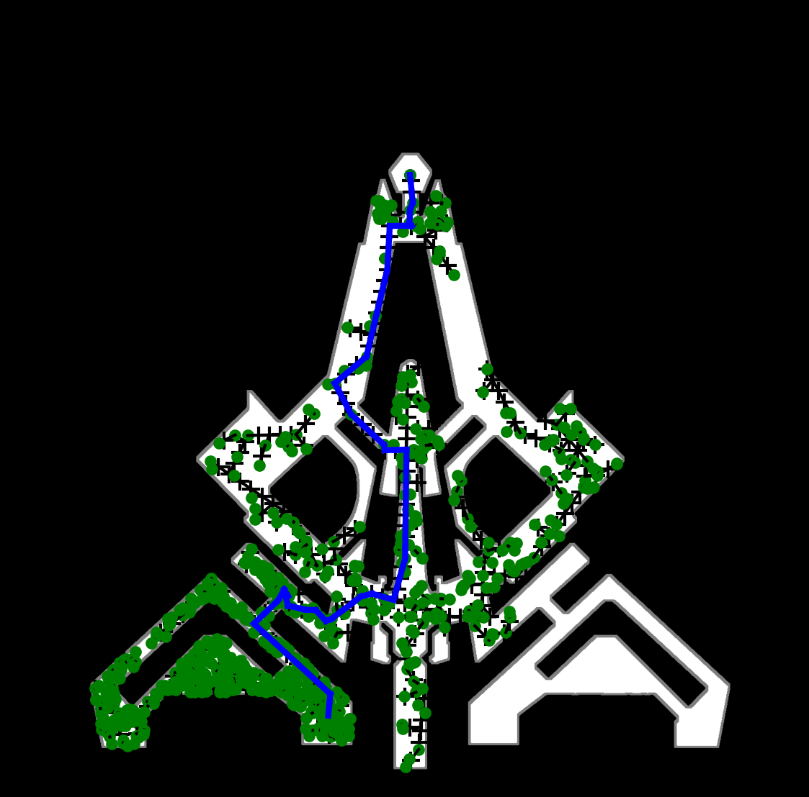

# StarRail_Navigation

一个基于RRT算法的路径规划小demo。先将崩铁地图处理为黑白图，例如白色为角色可移动空间，选择一个起始点和目标点，用RRT算法生成路径并选择最短路线。

使用：

run `rrt.py`,在空白处选一个点作为起始点，再选一个点作为终点

This is a navigation proposal and demonstration for StarRail. The main idea is to extract a clear map and convert it to black and white images.

Different from Genshin Impact, StarRail has a clearer, simpler, and more concise concept map image, which makes it easy to distinguish pathways and obstacles.

The white part is the free space to walk and run, while the black part consists of walls and obstacles.

The path search algorithm proposed and demonstrated is Rapidly Exploring Random Tree (RRT). The path node will be randomly generated like tree branches from the start point to the target point. The path with the shortest travel distance will be connected as the planned path.

# Example:

| Original Map                | Filtered Map                         | Planned Path                         |
| --------------------------- | ------------------------------------ | ------------------------------------ |
|  |  |  |
